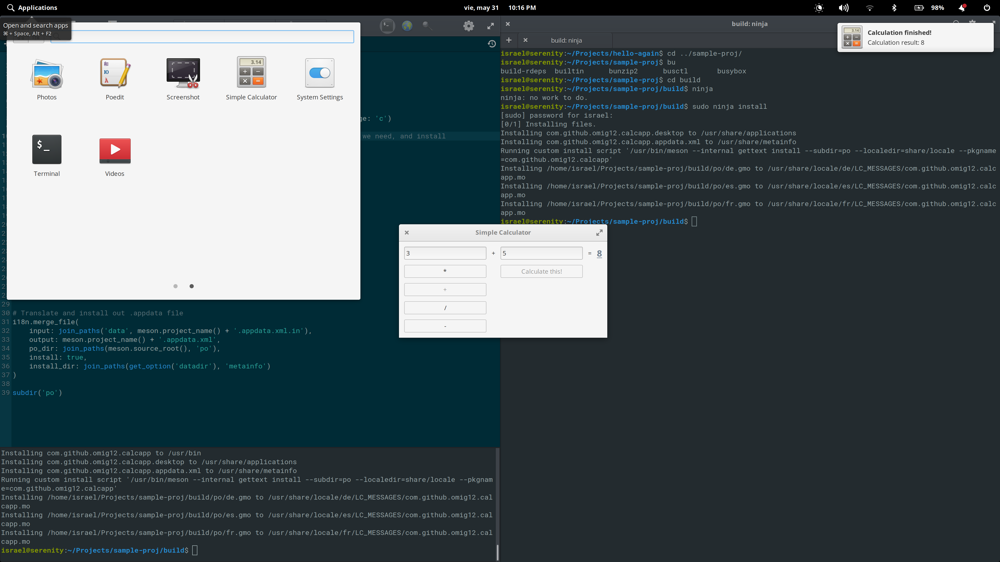

# Simple Calculator

----------------------------------------

This app presents a simple calculator where you pick one of the following operators: Multiplication, Division, Addition, \& Substraction ( \*, \/, \+, \-) respectively, enter two numeric inputs, and then press a button to calculate. The results will be displayed on the app and in a system notification.
